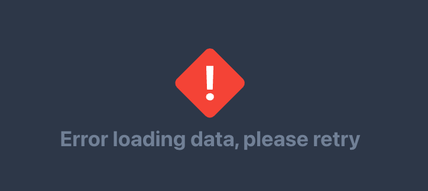
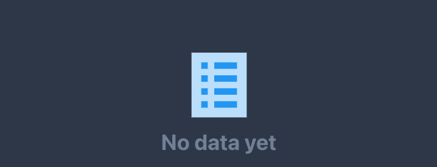

# useQueryStateLayout

Meet a new and elegant way of managing your GET queries components (strongly typed) by combining [TanStack Query](https://tanstack.com/query/v4) and [Legend State](https://legendapp.com/open-source/state) with 4 possible states:
- `ComponentState.Loading`
- `ComponentState.Error`
- `ComponentState.Empty`
- `ComponentState.Hydrated`

enforcing the good pattern of handling errors and empty placeholders smoothly, with a flat linear structure.

## How to use

`useQueryLayout` is generic and can be used with any type of data. Here, the type is inferred from the `queryFn` return type.

```typescript jsx
const Component = () => {
  const {layout} = useQueryLayout({
    queryKey: ['getPosts'],
    queryFn: () => api.get<Post[]>(`/posts`).then(res => res.data),
    loadingLayout: <Placeholder />,
    hydratedLayout: posts => <PostList posts={posts} />,
  })

  return <Body layout={layout} />
}
```

Cherry on the cake: loadingLayout, errorLayout and emptyLayout are optional and can be omitted: some default are implemented already for you.

## Customize

Here are all the options you can pass to customize the hook `useQueryLayout`:

```typescript jsx  
const Component = () => {
  const {layout} = useQueryLayout({
    queryKey: string[], // `Query` is an array of string,
    queryFn: () => (...), // your fetcher function
    hydratedLayout: data => (...), // your layout to render data or data list
    enabled?: boolean, // optional, default true
    loadingLayout?: ReactNode | ReactNode[], // optional, default provided
    errorLayout?: ReactNode | ReactNode[], // optional, default provided
    emptyLayout?: ReactNode | ReactNode[], // optional, default provided
    errorLayoutIcon?: IconType, // optional, default provided from react-icons
    errorLayoutMessage?: string, // optional, default provided
    emptyLayoutIcon?: IconType, // optional, default provided from react-icons
    emptyLayoutMessage?: string, // optional, default provided
    iconSize?: number, // optional, default 128, default layout icon size
  })

  /* This self actualize to show:
  - ComponentState.Loading
  - ComponentState.Error
  - ComponentState.Empty  
  - or ComponentState.Hydrated
  */
  return layout 
}
```

### Default error layout



### Default empty layout



## Use Legend state power

There is a second hook drop in replacement `useObservableQueryLayout` that can be used with [Legend State](https://legendapp.com/open-source/state) to manage your state. It allows you to use the power of [For](https://legendapp.com/open-source/state/fine-grained-reactivity/#for) in legend state for example.

```typescript jsx
const Component = () => {
  const {layout} = useObservableQueryLayout({
    queryKey: ['getPosts'],
    queryFn: () => api.get<Post[]>(`/posts`).then(res => res.data),
    loadingLayout: <Placeholder />,
    hydratedLayout: posts => (
      <SimpleGrid columns={2} spacing={5}>
        <For each={posts} optimized> // Using legend state rocks
          {item => <PostItem post={item.get()!} />}
        </For>
      </SimpleGrid>
    ),
  })

  return layout
}
```
